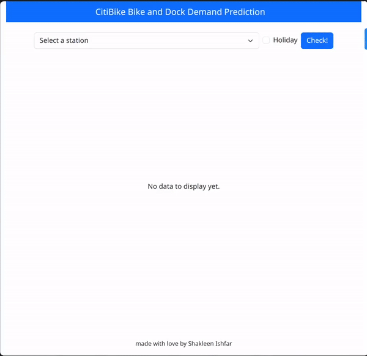
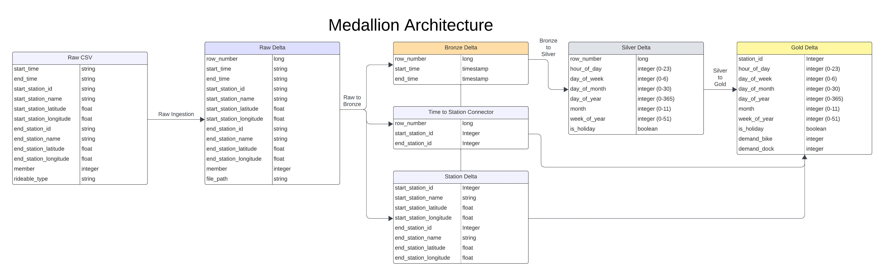

# Bike & Dock Demand Prediction System for CitiBike NYC

Citi Bike, New York City’s bike share system, provides a network of docking stations across the city, allowing users to unlock bikes from one station and return them to any other. The success of the bike-sharing business hinges on ensuring that users can readily access bikes when needed and find available docking stations at the end of their rides. Consequently, there is a dual demand for both bike availability and empty docking stations. 

This project is a data-driven system designed to predict hourly bike and dock demand for all CitiBike stations. Leveraging data spanning from 2013 to the present **(over 250 million records)**, the system uses Apache Spark, Delta Lake, and the Medallion Architecture to efficiently process and analyze data. Machine learning models trained on this data are used to make predictions, and a Flask web interface provides real-time forecasts of bike and dock availability for users.


<center></center>

## Table of Contents

1. [Technologies Used](#technologies-used)
1. [System Architecture](#system-architecture)
1. [Data Pipeline](#data-pipeline)
1. [Machine Learning Pipeline](#machine-learning-pipeline)
1. [Web Interface](#web-interface)
1. [Testing & CI/CD](#testing--cicd)
1. [Installation & Usage](#installation--usage)
1. [Contributing](#contributing)
1. [License](#license)
1. [Resources](#resources)

## Technologies Used
1. **PySpark** and **DeltaLake** to manage data ingestion and transformation
1. **MLLib** and **MLFlow** for model development, tracking, and evluation
1. **Flask** to create front end
1. **GitHub Actions** for CI/CD
1. **PyTest** for writing tests

## System Architecture

The system follows a distributed architecture built using Apache Spark and Delta Lake, following the Medallion Architecture:

1. **Data Ingestion and Processing**: Data is ingested from raw CSV files and stored in various Delta Lake stages (Raw, Bronze, Silver, and Gold) as it is cleaned, transformed, and enriched.
1. **Distributed Machine Learning**: Models are trained on large-scale data using Apache Spark's MLlib for distributed machine learning.
1. **Real-Time Forecasting**: A Flask web interface provides real-time predictions of bike and dock demand at any CitiBike station for the next 6 hours.

## Data Pipeline



### Raw Delta Lake
* **Source**: Raw CitiBike CSV data (2013-present).
* **Action**: Enforce schema and store data in the Raw Delta Lake.
* Details: Data includes more than _250 million records_ across multiple years.

### Bronze Delta Lake
* **Source**: Raw Delta Lake.
* **Action**: 
    * Correct column data types.
    * Impute missing values.
    * Split data into two separate tables:
        * Ride Info Table (trip details).
        * Station Info Table (station details).
* **Outcome**: The Bronze Delta is half the size of the Raw Delta due to reduced redundancy.

### Silver Delta Lake
* **Source**: Bronze Delta Lake.
* **Action**: Create additional time-based features such as hour of day, day of week, and more.
* **Outcome**: Feature-enriched data suitable for machine learning.

### Gold Delta Lake
* **Source**: Silver Delta Lake.
* **Action**:
    * Standardize feature values.
    * Encode categorical columns.
* **Outcome**: Final prepared dataset used for training machine learning models.

## Machine Learning Pipeline
The system's machine learning pipeline is built using Spark MLlib for distributed learning and uses MLflow for tracking data and model versions, as well as key metrics. The following models were tested:

* **Random Forest** - Decision-tree based ensemble model.
* **Gradient Boosted Trees** - Advanced ensemble model for better accuracy.

All models are trained on the Gold Delta Lake and evaluated based on their prediction accuracy for hourly bike and dock demand.

## Web Interface
A Flask web application was built to provide real-time predictions of bike and dock demand. Users can select a CitiBike station and view a graph showing the predicted demand for bikes and docks over the next 6 hours.

* **Input**: User selects a CitiBike station.
* **Output**: Predicted bike and dock demand for the next 6 hours is displayed.

## Testing & CI/CD

The project includes comprehensive testing and continuous integration:

* **Unit Testing**: Implemented using pytest.
* **CI/CD**: Set up using GitHub Actions to automatically run tests on every push to the main branch.

## Installation & Usage

### Installation

```bash
git clone https://github.com/Shakleen/CitiBike-Demand-Prediction
cd citibike-demand-prediction
pip install .
```

### Usage
Start the Flask web application
```bash
python3 app.py
```

Open a web browser and navigate to http://localhost:5000 to access the bike and dock demand prediction system.

## License
This project is licensed under the MIT License - see the LICENSE file for details.

## Resources
1. [Unit testing PySpark code using Pytest](https://engineeringfordatascience.com/posts/pyspark_unit_testing_with_pytest/)
1. [Fine-Grained Time Series Forecasting At Scale With Facebook Prophet And Apache Spark](https://www.databricks.com/blog/2020/01/27/time-series-forecasting-prophet-spark.html)