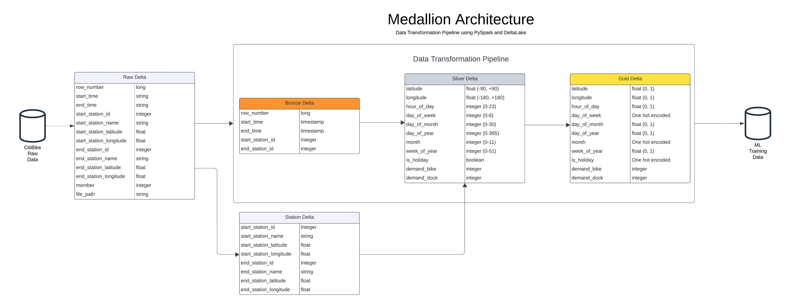

# CitiBike-Demand-Prediction
An End-to-End Machine Learning project where I predict demand of bikes at citibike stations at hourly level.

## Business Objective

The success of the bike-sharing business hinges on ensuring that users can readily access bikes when needed and find available docking stations at the end of their rides. Consequently, there is a dual demand for both bike availability and empty docking stations. This project aims to forecast these demands on an hourly basis for each station in New York City. Accurate demand predictions will enhance the coordination of bike redistribution efforts, ultimately leading to increased profitability.

## Technical Details

### Technologies Used
1. **PySpark** and **DeltaLake** to manage data ingestion and transformation
1. **MLFlow** for model development
1. **Flask** to create front end
1. **Git** and **GitHub** for project management
1. **GitHub Actions** for CI/CD
1. **PyTest** for writing tests

### Medallion Data Architecture

## Acknowlegements
1. [Unit testing PySpark code using Pytest](https://engineeringfordatascience.com/posts/pyspark_unit_testing_with_pytest/)